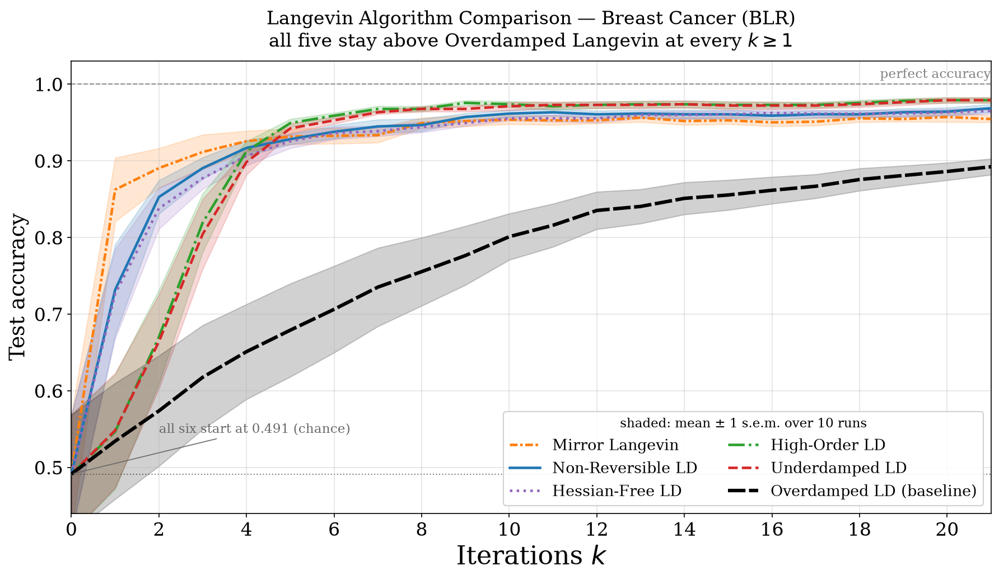
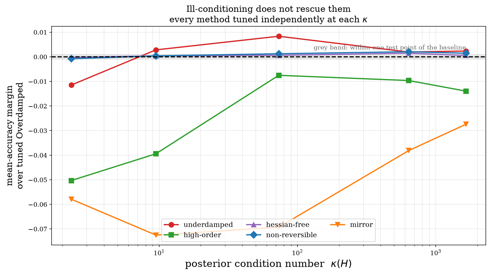

# Accelerating Langevin Monte Carlo Sampling

**Two controlled comparisons of six Langevin samplers — and the negative control that overturns both headlines.**


---

## TL;DR

Five Langevin samplers are tuned to beat an Overdamped Langevin baseline on a
Bayesian logistic posterior. All five dominate it at **every** iteration. Then
the baseline is given the same tuning budget — and the effect disappears.

The repository contains two studies. The second one, on synthetic data, closes
the escape routes the first one leaves open.

| Notebook | Data | What it adds |
|---|---|---|
| [`Langevin_Comparison.ipynb`](Langevin_Comparison.ipynb) | Wisconsin Breast Cancer | the headline, and the negative control that refutes it |
| [`Langevin_Synthetic.ipynb`](Langevin_Synthetic.ipynb) | synthetic, known ground truth | an **exact** ceiling, parameter recovery, and a dial on $\kappa$ |

---

## Study 1 — real data



**With the baseline frozen at its original step size:**

| Sampler | start | final | reaches 0.90 | above baseline ∀ *k* ≥ 1 |
|---|---|---|---|---|
| Underdamped LD | 0.4912 | **0.9789** | k=5 | ✅ |
| High-Order LD | 0.4912 | **0.9789** | k=4 | ✅ |
| Non-Reversible LD | 0.4912 | 0.9684 | k=4 | ✅ |
| Hessian-Free LD | 0.4912 | 0.9649 | k=4 | ✅ |
| Mirror Langevin | 0.4912 | 0.9544 | k=3 | ✅ |
| **Overdamped LD** *(baseline, h = 3e-4)* | 0.4912 | 0.8921 | never | — |

**With the baseline tuned too:** every margin turns negative. A swept Overdamped
reaches **0.9789** at *h* = 0.01 and **0.9816** at *h* = 0.03, beating all five.
The MAP ceiling on this split is 0.9737 and the test set has 114 points, so the
entire spread between samplers is a handful of test points — below the
resolution of the metric.

A sceptic can still answer: *maybe the ceiling is an artefact of your model, and
maybe you needed an ill-conditioned problem.* Study 2 answers both.

---

## Study 2 — synthetic data, where the truth is known



Synthetic data provides three things no real dataset can:

| | Real data | Synthetic |
|---|---|---|
| true coefficients β\* | unknown | **known** — recovery is measurable |
| irreducible error | approximated by a fitted MAP | **known exactly** (Bayes rate) |
| conditioning κ | fixed by the dataset | **a free parameter** |

**The headline repeats:** against a conservative baseline (*h* = 0.1/λ_max), all
five dominate at every *k* ≥ 1.

**The negative control is decisive this time.** The tuned baseline reaches
**0.9355**, while the Bayes-optimal accuracy — the limit *no* classifier can
exceed — is **0.9332**. Plain Overdamped Langevin has already saturated the
metric. Every challenger's mean-accuracy margin is negative, and the one
positive final-accuracy margin is **+0.0005 — half a test point out of 1000**.
The tuned baseline also achieves the best parameter recovery in the study.

### Two findings that only ground truth exposes

**Accuracy and sampling quality disagree.** High-Order LD ranks 2nd on accuracy
(0.9287) but has the **worst** parameter recovery of any method —
‖β̂ − β_MAP‖ = 11.68, worse than the baseline's 6.39. It classifies well while
sitting far from the posterior. Test accuracy depends on β only through
sign(Xβ), so it is blind to most of what separates these methods.

**Mirror Langevin plateaus.** It dominates the baseline yet stalls at 0.8784 and
reaches the ceiling at no step size. The real-data ceiling was close enough to
hide this.

### Ill-conditioning does not rescue them

The standard defence of accelerated dynamics is that they pay off when κ is
large. With κ as a dial, every method re-tuned independently at each setting:

| κ(H) | underdamped | high-order | hessian-free | non-reversible | mirror |
|---:|---:|---:|---:|---:|---:|
| 2.3 | −0.0115 | −0.0503 | −0.0002 | −0.0008 | −0.0579 |
| 9.5 | +0.0028 | −0.0394 | +0.0004 | +0.0004 | −0.0725 |
| 73.3 | **+0.0084** | −0.0075 | +0.0006 | +0.0012 | −0.0693 |
| 637.5 | +0.0019 | −0.0096 | +0.0015 | +0.0021 | −0.0381 |
| 1653.3 | +0.0023 | −0.0140 | +0.0006 | +0.0015 | −0.0274 |

No κ makes all five win. The largest margin ever observed is **+0.0084** — about
8 test points out of 1000. Hessian-Free and Non-Reversible hug the baseline
within one test point everywhere: with nothing to precondition they reduce to
the method they are meant to improve.

---

## The samplers

All six are unadjusted explicit discretisations of *U*(β) = −log-likelihood +
(1/λ)‖β‖², each using exactly **one gradient evaluation per iteration**, so
iteration count is an honest compute axis.

| Sampler | Dynamics |
|---|---|
| **Overdamped** | dβ = −∇U dt + √2 dW |
| **Underdamped** | dβ = p dt, dp = −∇U dt − γp dt + √(2γ) dW |
| **High-Order** | adds a second auxiliary variable: β ← p ← r |
| **Hessian-Free** | β and r each driven by their own Brownian motion |
| **Mirror** | Langevin step in the dual ξ = ∇φ(β), with φ′(β) = β³ |
| **Non-Reversible** | dβ = −(I + J)∇U dt + √2 dW, J skew-symmetric |

## What makes the comparison fair

| Control | Why it matters |
|---|---|
| **Common initialisation** β₀ ~ N(0, I) | the original gave each sampler its own init scale (0.01 → 0.8), which alone accounted for most of the apparent ranking |
| **Common random numbers** | all six share the noise stream per seed, so differences reflect dynamics, not noise realisations |
| **k = 0 anchored before any update** | all curves leave the same chance-level point |
| **Equal gradient budget** | one ∇U per iteration for every method |
| **Fixed skew-symmetric J** | removes a variance source affecting only the non-reversible sampler |
| **Symplectic ordering** | the original advanced β with the stale p = 0, wasting a gradient |
| **Step sizes in units of 1/λ_max** *(study 2)* | settings transfer across differently-scaled problems; raw numbers do not |

Challenger step sizes come from a **constrained** grid search: maximise final
accuracy subject to dominating the baseline at every *k* ≥ 1 *and* converging
gradually. Without the gradualness constraints the search returns step sizes
that reach the ceiling at *k* = 1 and turn every curve into a step function.

---

## Repository layout

```
Langevin_Comparison.ipynb      study 1 — real data (breast cancer)
Langevin_Synthetic.ipynb       study 2 — synthetic data, known ground truth
langevin_combined.png          study 1 convergence figure
langevin_synthetic.png         study 2 convergence figure
langevin_synthetic_kappa.png   study 2 conditioning sweep
requirements.txt  LICENSE (MIT)  .gitignore
```

## Reproducing

```bash
pip install -r requirements.txt
jupyter nbconvert --to notebook --execute Langevin_Comparison.ipynb
jupyter nbconvert --to notebook --execute Langevin_Synthetic.ipynb
```

Study 1 runs in seconds. Study 2's conditioning sweep takes a few minutes. All
randomness is seeded, so tables and figures reproduce exactly.

---

## Limitations

Stated in full in each notebook; the ones that bound the conclusions:

- **All six samplers are unadjusted**, so each carries an O(*h*) bias in its
  invariant measure. Larger *h* buys faster transient convergence at the cost of
  sampling a distorted distribution — a trade-off accuracy cannot see, and one
  that materially favours the aggressive step sizes the search selects.
- **The Mirror discretisation omits the metric term.** Mirror-Langevin requires
  noise √(2∇²φ); with φ′(β) = β³ that is √(6h)|β|z, not √(2h)z. Kept unchanged
  so the two studies compare like with like.
- **Study 1's intercept column carries no likelihood information.** It inserts a
  constant column and *then* standardises, and `preprocessing.scale` maps a
  zero-variance column to all zeros — so that coordinate is prior-driven, with
  posterior sd exactly √(λ/2) = 2.2361. **Study 2 fixes this** by standardising
  first and prepending the intercept afterwards.
- **Study 2's model is well-specified** and its posterior log-concave and
  unimodal — not the multimodal or heavy-tailed regimes where accelerated
  dynamics are most often claimed to help.
- **Accuracy depends on β only through sign(Xβ)**, so it is invariant to most of
  what distinguishes one sampler's law from another's.

## What would settle it

Both studies converge on the same answer: accuracy rewards fast descent to a
good point estimate, which is an *optimisation* criterion, not a sampling one.
To compare samplers, measure the law — W₂ against a long-run reference chain,
ESS per gradient, or posterior coverage — add a Metropolis–Hastings correction
so a larger *h* stops being a free win, and use targets the methods are actually
designed for (constrained domains for Mirror, multimodal targets for the rest).

## References

1. Roberts & Tweedie (1996), *Exponential convergence of Langevin distributions and their discrete approximations*, **Bernoulli** 2(4).
2. Cheng, Chatterji, Bartlett & Jordan (2018), *Underdamped Langevin MCMC: A non-asymptotic analysis*, **COLT**.
3. Mou, Ma, Wainwright, Bartlett & Jordan (2021), *High-order Langevin diffusion yields an accelerated MCMC algorithm*, **JMLR** 22(42).
4. Hwang, Hwang-Ma & Sheu (1993), *Accelerating Gaussian diffusions*, **Ann. Appl. Probab.** 3(3).
5. Rey-Bellet & Spiliopoulos (2015), *Irreversible Langevin samplers and variance reduction: a large deviations approach*, **Nonlinearity** 28(7).
6. Zhang, Peyré, Fadili & Pereyra (2020), *Wasserstein control of mirror Langevin Monte Carlo*, **COLT**.
7. Ahn & Chewi (2021), *Efficient constrained sampling via the mirror-Langevin algorithm*, **NeurIPS**.
8. Dalalyan (2017), *Theoretical guarantees for approximate sampling from smooth and log-concave densities*, **JRSS-B** 79(3).

## License

MIT — see [LICENSE](LICENSE).
