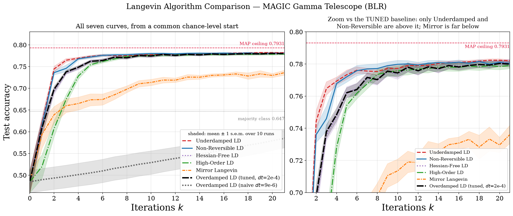
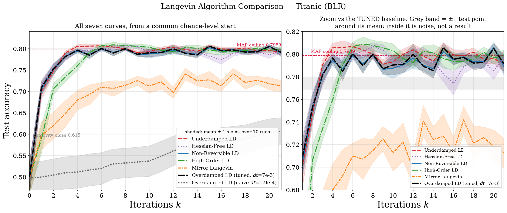
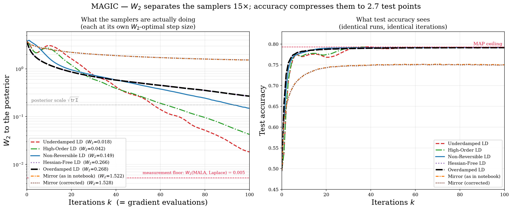

# Accelerating Langevin Monte Carlo Sampling

**Five controlled comparisons of six Langevin samplers — and the negative control that overturns every headline.**


---

## TL;DR

Five Langevin samplers are tuned to beat an Overdamped Langevin baseline on a
Bayesian logistic posterior. All five dominate it at **every** iteration. Then
the baseline is given the same tuning budget — and the effect disappears.

Everything in this repository follows from pushing on that one observation
across five experiments, each designed to close an escape route the previous
one left open.

| # | Notebook | Data | The question it settles |
|---|---|---|---|
| 1 | [`Langevin_Comparison_on_real_data.ipynb`](Langevin_Comparison_on_real_data.ipynb) | Breast Cancer | the headline, and the control that refutes it |
| 2 | [`Langevin_MAGIC.ipynb`](Langevin_MAGIC.ipynb) | MAGIC Gamma Telescope | a dataset with real headroom — does the ranking survive? |
| 3 | [`Langevin_Titanic.ipynb`](Langevin_Titanic.ipynb) | Titanic | statistical vs. **practical** significance |
| 4 | [`Langevin_MAGIC_W2_ESS.ipynb`](Langevin_MAGIC_W2_ESS.ipynb) | MAGIC | change the **metric**: $W_2$ and ESS instead of accuracy |
| 5 | [`Langevin_Synthetic.ipynb`](Langevin_Synthetic.ipynb) | synthetic | known ground truth, exact ceiling, and a dial on $\kappa$ |

---

## The arc

### 1 · Breast cancer — the headline, and its refutation


All five challengers dominate the baseline at every *k* ≥ 1: Underdamped and
High-Order finish at **0.9789**, the baseline at **0.8921**.

Then the control: a swept Overdamped reaches **0.9789** at *h* = 0.01 and
**0.9816** at *h* = 0.03, beating all five. Every margin turns negative. The MAP
ceiling is 0.9737 and the test set has 114 points, so the entire spread between
samplers is a handful of test points — below the metric's resolution.

*Escape route left open: maybe this dataset is just too easy.*

### 2 · MAGIC — a dataset with real headroom



19,020 points, logistic regression tops out at 0.7931, 3804 test points. Against
a naive baseline, 5/5 win again. Against a **tuned** baseline, on 50 held-out
seeds: only **2/5**. Underdamped is genuinely faster (+0.0078 mean trajectory
accuracy, *p* ≈ 1e-13), Non-Reversible marginally so, Hessian-Free ties, and
High-Order and Mirror are significantly **worse**.

*Escape route left open: are those margins actually meaningful?*

### 3 · Titanic — statistical vs. practical significance



179 test points, so one misclassification is 0.56% accuracy. On 200 held-out
seeds **nothing clears one test point in the positive direction.** Underdamped's
*p* = 2e-33 win is worth **0.78 of a single test point**. Non-Reversible reaches
*p* = 0.02 with a margin of **0.03 test points** — a textbook significant-but-
meaningless result, and the tuner independently drove its `jscale` to 0.05, i.e.
asked for the mechanism to be switched off. The only margins exceeding one test
point are the two negative ones.

*Conclusion: accuracy is the wrong instrument. So change it.*

### 4 · MAGIC under $W_2$ and ESS — the metric was the problem



Same runs, two metrics. Across the five non-Mirror samplers, test accuracy spans
**2.7 test points**; $W_2$ to the posterior spans a factor of **15**.

| sampler | $W_2$ (k=100) | vs overdamped | ESS/grad | bias floor |
|---|---|---|---|---|
| **Underdamped** | **0.018** | **14.7× closer** | **2.1×** | **3.8× less biased** |
| High-Order | 0.042 | 6.3× | 1.8× | 3.0× |
| Non-Reversible | 0.149 | 1.8× | 1.7× | 0.5× (*more* biased) |
| Hessian-Free | 0.266 | 1.0× | 0.9× | 1.0× |
| Overdamped | 0.268 | — | — | — |
| Mirror (either version) | 1.52 | **0.2×** | 0.7× | 0.03× |

Two rankings invert versus the accuracy studies: **High-Order goes from last to
second**. And correcting Mirror's missing metric term (noise √(6h)|β|z rather
than √(2h)z) changes nothing — 1.522 vs 1.528 — so its failure is the
mismatched cubic geometry, not the implementation.

Ground truth is an exact Metropolis-adjusted MALA chain in whitened
coordinates, validated against the Laplace approximation to 0.005 — 2.9% of the
posterior scale, which sets the resolution floor.

*Escape route left open: maybe the ceiling is an artefact of the model class, and
maybe you needed an ill-conditioned problem.*

### 5 · Synthetic — where the truth is known


Data generated from a known logistic model buys three things no real dataset
can: the true β\*, an **exact** Bayes-optimal ceiling, and **κ as a free
parameter**.

The headline repeats — 5/5 dominate a conservative baseline. The control is
decisive: the tuned baseline reaches **0.9355** against a Bayes-optimal ceiling
of **0.9332**. It has already saturated the metric. Every challenger's mean
margin is negative; the one positive final margin is **+0.0005, half a test
point out of 1000**. The tuned baseline also achieves the best parameter
recovery in the study.

**Accuracy and sampling quality disagree.** High-Order ranks 2nd on accuracy
(0.9287) but has the **worst** recovery of any method — ‖β̂ − β_MAP‖ = 11.68 vs
the baseline's 6.39. It classifies well while sitting far from the posterior.

**Ill-conditioning does not rescue them.** With every method re-tuned at each κ:

| κ(H) | underdamped | high-order | hessian-free | non-reversible | mirror |
|---:|---:|---:|---:|---:|---:|
| 2.3 | −0.0115 | −0.0503 | −0.0002 | −0.0008 | −0.0579 |
| 9.5 | +0.0028 | −0.0394 | +0.0004 | +0.0004 | −0.0725 |
| 73.3 | **+0.0084** | −0.0075 | +0.0006 | +0.0012 | −0.0693 |
| 637.5 | +0.0019 | −0.0096 | +0.0015 | +0.0021 | −0.0381 |
| 1653.3 | +0.0023 | −0.0140 | +0.0006 | +0.0015 | −0.0274 |

No κ makes all five win; the largest margin ever observed is +0.0084, about 8
test points out of 1000.

---

## What the five studies establish together

| | 1 · Cancer | 2 · MAGIC | 3 · Titanic | 4 · W₂/ESS | 5 · Synthetic |
|---|---|---|---|---|---|
| 5/5 beat an untuned baseline | ✅ | ✅ | ✅ | — | ✅ |
| Survives tuning the baseline | ❌ | 2/5 | 0/5 | **✅ (W₂)** | ❌ |
| Ceiling is | fitted MAP | fitted MAP | fitted MAP | a validated MALA chain | the **exact** Bayes rate |
| Metric has resolution | ❌ | ✅ | ❌ | ✅ | ✅ |

**The methodological claim**, which is not specific to Langevin dynamics: *a
comparison that tunes its proposals but not its baseline produces a ranking that
measures tuning effort.* Four of the five studies show the manufactured version;
study 4 shows what a real result looks like once the metric can see it.

**The substantive claim:** under a metric that measures the posterior rather than
a point prediction, **Underdamped Langevin has a genuine, large advantage** —
14.7× closer in $W_2$ for the same gradient budget, 2.1× the ESS per gradient.
On test accuracy that same advantage is worth under three test points.

---

## The samplers

All six are unadjusted explicit discretisations of *U*(β) = −log-likelihood +
(1/λ)‖β‖², each using exactly **one gradient evaluation per iteration**, so
iteration count is an honest compute axis.

| Sampler | Dynamics |
|---|---|
| **Overdamped** | dβ = −∇U dt + √2 dW |
| **Underdamped** | dβ = p dt, dp = −∇U dt − γp dt + √(2γ) dW |
| **High-Order** | adds a second auxiliary variable: β ← p ← r |
| **Hessian-Free** | β and r each driven by their own Brownian motion |
| **Mirror** | Langevin step in the dual ξ = ∇φ(β), with φ′(β) = β³ |
| **Non-Reversible** | dβ = −(I + J)∇U dt + √2 dW, J skew-symmetric |

## What makes the comparisons fair

| Control | Why it matters |
|---|---|
| **Common initialisation** β₀ ~ N(0, I) | the original gave each sampler its own init scale (0.01 → 0.8), which alone accounted for most of the apparent ranking |
| **Common random numbers** | all six share the noise stream per seed, so differences reflect dynamics, not noise realisations |
| **k = 0 anchored before any update** | all curves leave the same chance-level point |
| **Equal gradient budget** | one ∇U per iteration for every method |
| **Fixed skew-symmetric J** | removes a variance source affecting only the non-reversible sampler |
| **Symplectic ordering** | the original advanced β with the stale p = 0, wasting a gradient |
| **Held-out seeds** (studies 2, 3) | step sizes tuned on one seed set, claims tested on another, paired |
| **Step sizes in units of 1/λ_max** (study 5) | settings transfer across differently-scaled problems; raw numbers do not |
| **Validated reference** (study 4) | W₂ ground truth from MH-corrected MALA, checked against Laplace |

---

## Repository layout

```
Langevin_Comparison_on_real_data.ipynb   study 1 — breast cancer
Langevin_MAGIC.ipynb                     study 2 — MAGIC gamma telescope
Langevin_Titanic.ipynb                   study 3 — Titanic
Langevin_MAGIC_W2_ESS.ipynb              study 4 — W2 and ESS on MAGIC
Langevin_Synthetic.ipynb                 study 5 — synthetic, known truth

langevin_combined.png                    study 1 figure
langevin_magic.png                       study 2 figure
langevin_titanic.png                     study 3 figure
langevin_magic_w2.png                    study 4 figure
langevin_synthetic.png                   study 5 convergence
langevin_synthetic_kappa.png             study 5 conditioning sweep

magic.tsv.gz                             MAGIC data (PMLB copy, sha256 c823ea26…c07f)
titanic.csv                              Titanic data (Kaggle train.csv, 891 rows)
requirements.txt  LICENSE (MIT)  .gitignore
```

## Reproducing

```bash
pip install -r requirements.txt
jupyter nbconvert --to notebook --execute Langevin_Comparison_on_real_data.ipynb
```

Studies 1, 2, 3 and 5's main cells run in seconds to a few minutes. Study 4
takes roughly 10 minutes (1000-chain ensembles plus 2000-step warm-start
chains); study 5's κ sweep a few minutes. All randomness is seeded, so every
table and figure reproduces exactly.

Keep `magic.tsv.gz` and `titanic.csv` beside the notebooks. Both loaders fall
back to OpenML / UCI / a GitHub mirror if the local file is missing.

---

## Limitations

Each notebook states its own in full. Across the set:

- **All six samplers are unadjusted**, so each carries an O(*h*) bias in its
  invariant measure. Larger *h* buys faster transient convergence at the cost of
  sampling a distorted distribution — a trade-off accuracy cannot see, and one
  that favours the aggressive step sizes the search selects. Study 4 measures
  this bias directly (the "bias floor" column).
- **The Mirror discretisation omits the metric term** in studies 1, 2, 3 and 5.
  Study 4 implements both forms and finds the correction makes no material
  difference, so the omission is not what sinks it.
- **Studies 1 and 2 zero the intercept column.** They insert a constant column
  and *then* standardise, and `preprocessing.scale` maps a zero-variance column
  to all zeros — so that coordinate is prior-driven, with posterior sd exactly
  √(λ/2). Consequences, and the corrected κ for MAGIC (**181**, not ~47,000), are
  documented in a caveat at the top of `Langevin_MAGIC.ipynb`. **Studies 3, 4
  and 5 use the corrected order** (standardise first, prepend the intercept
  after). Studies 1 and 2 are left unmodified so the corrected and uncorrected
  MAGIC runs can be compared.
- **Accuracy depends on β only through sign(Xβ)**, so it is invariant to most of
  what distinguishes one sampler's law from another's. This is the thread running
  through all five studies.
- **Study 5's model is well-specified** and its posterior log-concave and
  unimodal — not the multimodal or heavy-tailed regimes where accelerated
  dynamics are most often claimed to help.

## What would settle the remaining questions

Study 4 is the template: measure the law, not a point prediction. Extending it
would mean adding a Metropolis–Hastings correction so a larger *h* stops being a
free win, running to stationarity rather than a fixed short budget, and using
targets the methods are actually designed for — constrained domains for Mirror
Langevin, multimodal targets for the rest.

## References

1. Roberts & Tweedie (1996), *Exponential convergence of Langevin distributions and their discrete approximations*, **Bernoulli** 2(4).
2. Cheng, Chatterji, Bartlett & Jordan (2018), *Underdamped Langevin MCMC: A non-asymptotic analysis*, **COLT**.
3. Mou, Ma, Wainwright, Bartlett & Jordan (2021), *High-order Langevin diffusion yields an accelerated MCMC algorithm*, **JMLR** 22(42).
4. Hwang, Hwang-Ma & Sheu (1993), *Accelerating Gaussian diffusions*, **Ann. Appl. Probab.** 3(3).
5. Rey-Bellet & Spiliopoulos (2015), *Irreversible Langevin samplers and variance reduction: a large deviations approach*, **Nonlinearity** 28(7).
6. Zhang, Peyré, Fadili & Pereyra (2020), *Wasserstein control of mirror Langevin Monte Carlo*, **COLT**.
7. Ahn & Chewi (2021), *Efficient constrained sampling via the mirror-Langevin algorithm*, **NeurIPS**.
8. Dalalyan (2017), *Theoretical guarantees for approximate sampling from smooth and log-concave densities*, **JRSS-B** 79(3).
9. Vehtari, Gelman, Simpson, Carpenter & Bürkner (2021), *Rank-normalization, folding, and localization: an improved R̂ for assessing convergence of MCMC*, **Bayesian Analysis** 16(2).

## Data sources

- **Breast Cancer** — `sklearn.datasets.load_breast_cancer` (Wisconsin Diagnostic).
- **MAGIC Gamma Telescope** — PMLB mirror of the UCI dataset, 19,020 rows, verified against its Git-LFS sha256.
- **Titanic** — the canonical Kaggle `train.csv`, 891 rows.
- **Synthetic** — generated in-notebook from a seeded logistic model.

## License

MIT — see [LICENSE](LICENSE).
